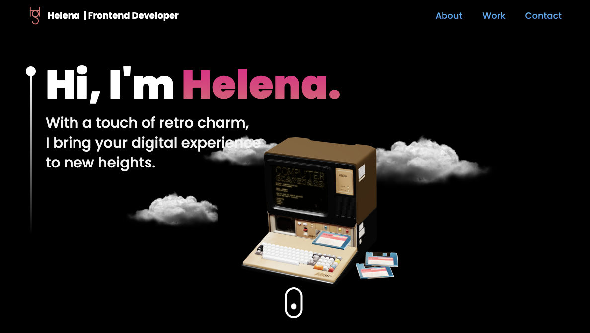

# Helena's 3D Portfolio

## Purpose

The main purpose of this project was to solidify my React skills and also learn Three.js and Framer Motion. I was inspired to create a 3D portfolio website after seeing impressive portfolio websites like [Bruno Simon's](https://bruno-simon.com/), and I was intrigued by how to incorporate 3D art into a website.

Through this project, I wanted to challenge myself to create a visually engaging website that showcases my skills as a frontend developer while also learning new technologies. By building and rebuilding the website from scratch, I was able to solidify my knowledge of React and learn how to use Three.js to create 3D art and Framer Motion to add animations to my components.

## Screenshot & Deployed App

You can visit my portfolio website here: [Helena Gilja - Frontend Developer](https://helenagilja.com/)



## Getting Started

If you'd like to explore and use my code - feel free to do so! And give it a star ⭐️

You can clone my repo on your local machine... 

1. Hit a green 'Code' button on my [GitHub Repo](https://github.com/cyberrie/helena-3D-portfolio) and coppy SSH key

2. Use the below command on yout Terminal (Mac) / Bash (Windows)
```
git clone <copy SSH key here>
```
3. Install all dependencies by running 
```
npm install
```
4. Run the App with
```
npm run dev
```
5. Feel free to experiment, add your own 3D art, create your own color theme and most importantly, enjoy! 🙃

## Contributions

Feel free to suggest changes or improvements by creating a PR or just getting in touch via my [Contact Form](https://helenagilja.com/#contact).

## Built with

* JavaScript: The programming language used to build the web application.
* React: A popular JavaScript library used for building user interfaces.
* Three.js: A 3D library that allows you to create and display animated 3D computer graphics in a web browser.
* Tailwind CSS: A utility-first CSS framework that makes it easy to design responsive and custom user interfaces.
* Vite: A build tool used for fast and efficient development, providing an instant server start-up time and quick bundling.
* Framer Motion: An animation library that provides easy-to-use components for adding animations to your React applications.

## Useful Links

- [React Docs](https://react.dev/) - always useful to have handy when working with React. 
- [Vite](https://vitejs.dev/) - for fastest build and deploy 🤯
- [Three.js](https://threejs.org/) - everything you need to know about 3D arts, Canvas, lighting, positioning...
- [Framer Motion - Animation Library](https://www.framer.com/motion/) - ready to use with React! Ofc you can manually create your animations, but this is so cool and has pre-made animations for your elements - amazing!
- [Sketchfab](https://sketchfab.com/feed) - the best website for finding 3D arts, most of them are free too!! 
- [Emailjs](https://www.emailjs.com/) - I used this to connect my contact form to my emails, it is so user friendly and simple! Check their docs or explore som tutorials on YT on how to use it. 

## Acknowledgements 

Big Thanks to my fellow developer [Andrew](https://github.com/ALayendecker) for reviewing parts of my Web App, feedback on UI/UX and help with debugging. 